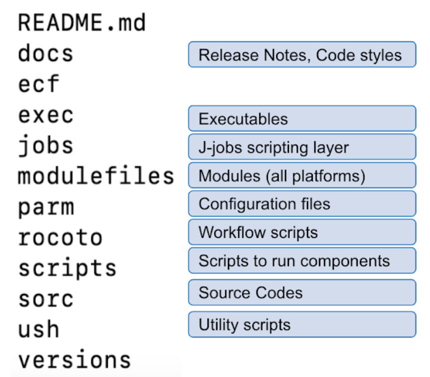
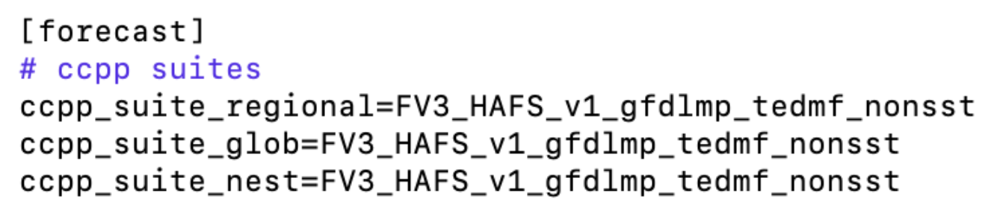
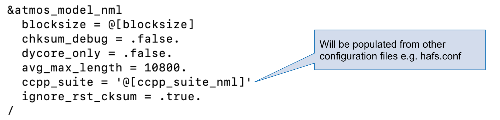

.. _ExtQuickStart:

*******************************
HAFS Extended Quick Start Guide
*******************************

Currently, the HAFS application works on these NOAA HPC platforms: wcoss_dell_p3, wcoss_cray, hera, jet, orion.

=================================
Clone and Checkout the Repository
=================================

.. code-block:: console

    git clone <-b BRANCH> --recursive https://github.com/hafs-community/HAFS.git

Select the branch to clone by setting the ``<-b BRANCH>`` option to the branch name.

.. note::
   ``develop`` is the default branch.

======================
Build and Install HAFS
======================

.. code-block:: console

    cd HAFS/sorc
    ./install_hafs.sh > install_hafs.log 2>&1

.. Hint::
   Got errors? Look into the ``HAFS/sorc/logs`` directory.

------------------------
Parts of install_hafs.sh
------------------------

* ``machine-setup.sh`` Determine shell, Identify machine, and Load modules

* ``build_all.sh`` Compile components: forecast, post, tracker, utils, tools, hycom, ww3, and gsi

* ``install_all.sh`` Copy executables to exec directory

* ``link_fix.sh`` Link fix files (fix files are available on disk)

===================
Run the HAFS System
===================

----------------
Edit system.conf
----------------

.. code-block:: console

    cd HAFS/parm
    cp system.conf.<system> system.conf
    vi system.conf

Edit the following:

* ``disk_project``

* ``tape_project``

* ``cpu_account``

* ``archive=disk`` Archive location (make sure you have write permission)

* ``CDSAVE`` Code parent directory

* ``CDNOSCRUB`` Track files will be copied to this location - contents won’t be scrubbed (make sure you have write permission)

* ``CDSCRUB`` If scrub set to yes, this will be removed (make sure you have write permission)

----------------------------
XML File to Run the Workflow
----------------------------

In ``HAFS/rocoto/hafs_workflow.xml.in`` the following can be modified to set the number of cycles and tasks.

* ``<!ENTITY CYCLE THROTTLE “5”>`` How many cycles can be activated at one time
* ``<!ENTITY TASK_THROTTLE “120”>`` How many tasks can be activated at one time
* ``<!ENTITY MAX_TRIES “1”>`` Maximum number of tries for all tasks

-------------------------------
Edit the Cron Job Driver Script
-------------------------------

Change the cron job driver script to set up your experiment and storm

.. code-block:: console

    cd ../rocoto
    vi cronjob_hafs.sh

Make sure you check ``HOMEhafs`` and edit as appropriate.

--------
Run HAFS
--------

Add the driver script in your cron tasks or simply run the driver script

.. code-block:: console

    ./cronjob_hafs.sh

To add the script to your cron

.. code-block:: console

    crontab -e
    */5 * * * * <path-to-HAFS>/rocoto/cronjob_hafs.sh

.. note::

   On Orion, cron is only available on the orion-login-1 node.

========================
HAFS Directory Structure
========================

The following shows the names of the files and directories in the ``HAFS`` directory.

==================
HAFS Configuration
==================

Look in ``HAFS/parm/hafs.conf`` to determine what physics suites are running.

To determine what physics schemes are included in the suites mentioned above:

.. code-block:: console

    more HAFS/sorc/hafs_forecast.fd/FV3/ccpp/suites/suite_FV3_HAFS_v1_gfdlmp_tedmf_nonsst.xml

===================
HAFS Namelist Files
===================

Two types of nesting configurations are available: (i) regional* and (ii) globnest.

* Two namelist files (templates) for regional configuration are:

  * ``HAFS/parm/forecast/regional/imput.nml.tmp``
  * ``HAFS/parm/forecast/regional/input_nest.nml.tmp``

* One namelist file (template) for globnest configuration is:

  * ``HAFS/parm/forecast/globnest/input.nml.tmp``

\* operational implementation
