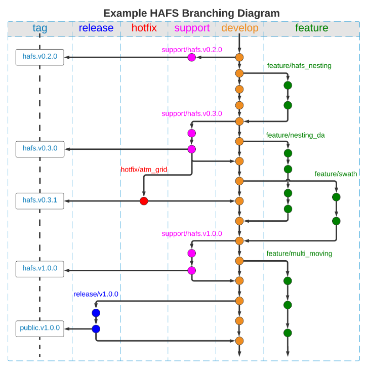

.. _RepositoryManagement:

*********************************
HAFS GitHub Repository Management
*********************************

The authoritative HAFS repository: 

- https://github.com/hafs-community/HAFS
- Maintained by EMC and DTC with developments and contributions from the UFS-HAFS application team and the hurricane research community
- HAFS forking/branching/tagging rational
    - develop: the main development branch
    - support/[name]: branches used by operational implementations or HFIP real-time parallel experiments (e.g., support/hafs.v0.2.0)
    - release/vx.x.x: public release branches (e.g., release/v1.0.0)
    - tag: hafs.v0.2.0, hafs.v1.0.0, public.v1.0.0, etc.
    - hotfix/[name]: temporary bug fix branches
    - feature/[name]: feature branches for adding new capabilities or enhancements
        - The HAFS repo only hosts major feature branches (e.g., feature/hafs_nesting) require active group collaborations, while individual feature branches are suggested to use personal HAFS forks

    Example HAFS Branching Diagram
